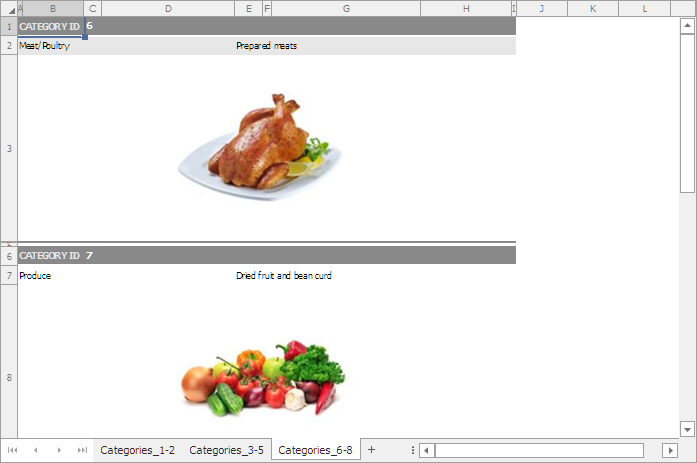

<!-- default badges list -->

<!-- default badges end -->
# Web Document Viewer - How to Store and Use Custom Document Data

This example shows how to serialize user data along with the document and use that data after the document is deserialized.

The application registers the [WebDocumentViewerOperationLogger](https://docs.devexpress.com/XtraReports/DevExpress.XtraReports.Web.WebDocumentViewer.WebDocumentViewerOperationLogger) 
class descendant to save, load and process user data. The overridden [CachedDocumentSourceSerializing](https://docs.devexpress.com/XtraReports/DevExpress.XtraReports.Web.WebDocumentViewer.WebDocumentViewerOperationLogger.---Zf----Sy----) method gets the category IDs displayed on a certain page and serializes them as custom data along with the document. The overridden [CachedDocumentSourceDeserialized](https://docs.devexpress.com/XtraReports/DevExpress.XtraReports.Web.WebDocumentViewer.WebDocumentViewerOperationLogger.--cK-------9--a-) method retrieves custom data from the document and uses the category IDs obtained from the custom data to name the worksheets when exporting the document to XLS or XLSX format.

## Files to Review

- [Global.asax.cs](CS/CustomCachedDocumentSourceSerialization/Global.asax.cs#L10) ([Global.asax.vb](VB/CustomCachedDocumentSourceSerialization/Global.asax.vb#L12))
- [CustomWebDocumentViewerOperationLogger.cs](CS/CustomCachedDocumentSourceSerialization/CustomWebDocumentViewerOperationLogger.cs) ([CustomWebDocumentViewerOperationLogger.vb](VB/CustomCachedDocumentSourceSerialization/CustomWebDocumentViewerOperationLogger.vb))
- [CustomPageDataService.cs](CS/CustomCachedDocumentSourceSerialization/CustomPageDataService.cs) ([CustomPageDataService.vb](VB/CustomCachedDocumentSourceSerialization/CustomPageDataService.vb))
- [CategoriesReport.cs](CS/CustomCachedDocumentSourceSerialization/CategoriesReport.cs) ([CategoriesReport.vb](VB/CustomCachedDocumentSourceSerialization/CategoriesReport.vb))

## Documentation

- [Document Viewer Lifecycle](https://docs.devexpress.com/XtraReports/401587/web-reporting/general-information-on-web-reporting/document-viewer-lifecycle)
- [Services in the Document Viewer](https://docs.devexpress.com/XtraReports/400226/web-reporting/asp-net-mvc-reporting/document-viewer-in-asp-net-mvc-applications/customization/register-services-in-the-document-viewer)

## More Examples

- [Reporting for Web (ASP.NET MVC) - How to Display the Name of the Current Logged in User in a Report](https://github.com/DevExpress-Examples/Reporting_webdocumentviewer-xrpageinfo-with-pageinfousername-display-the-name-of-a-logged-t484189)
- [How to implement a custom authorization service](https://github.com/DevExpress-Examples/Reporting_how-to-implement-a-custom-authorization-service-t488888)
<!-- feedback -->
## Does this example address your development requirements/objectives?

 

(you will be redirected to DevExpress.com to submit your response)
<!-- feedback end -->
